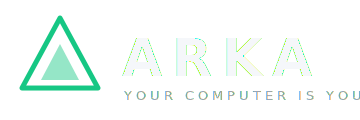
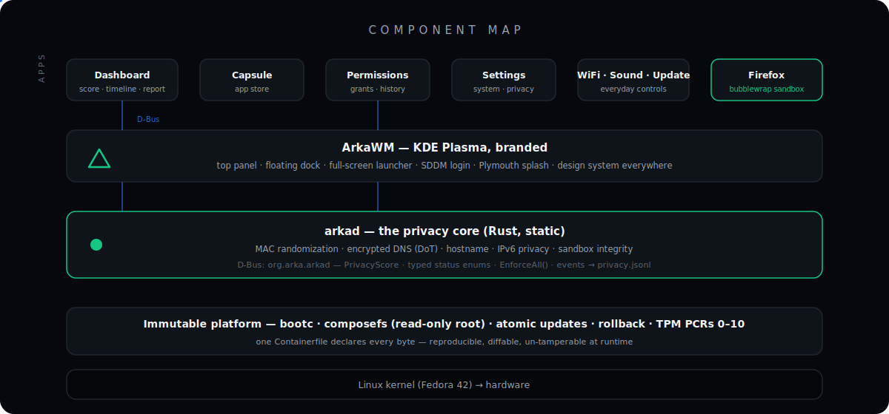
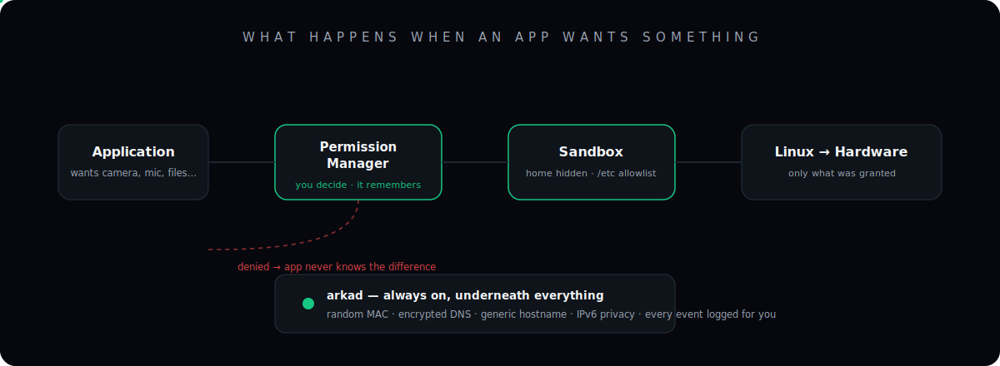
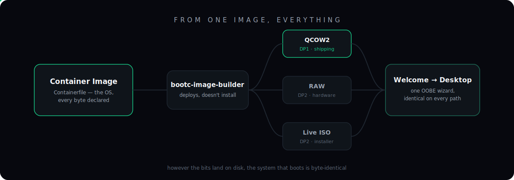
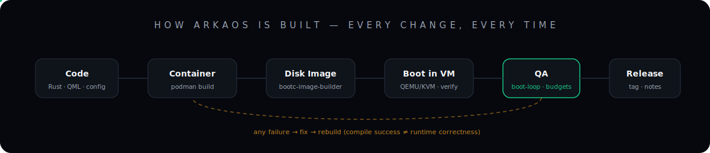
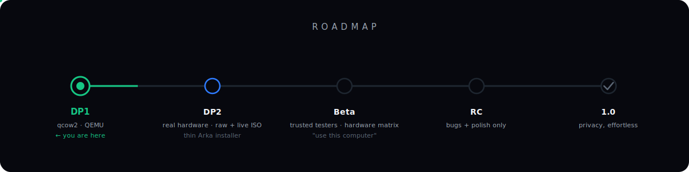

<p align="center">
  
</p>

<h3 align="center">Privacy-first • Immutable • Built on Linux • Designed for people</h3>

<p align="center"><em>A desktop operating system that makes secure computing simple, intuitive, and accessible.</em></p>

<p align="center">
  
  
  
  
</p>

<p align="center">
  
</p>

---

## What is ArkaOS?

ArkaOS is a privacy-first, immutable desktop operating system built on Linux,
designed to make secure computing simple, intuitive, and accessible for everyone.

It isn't trying to replace Linux — it builds on Linux's strengths while removing
unnecessary complexity and making powerful privacy and security features
available by default.

The OS ships as a single immutable image: updates are atomic, rollback is built
in, and the root filesystem is read-only at runtime. A system daemon —
[`arkad`](arkad/) — continuously enforces privacy protections and shows you
everything it did, in plain language.

> **Built on Linux. Designed for people.**

## Developer Preview 1

| | | |
|---|---|---|
| ✅ Immutable rootfs (composefs) | ✅ Atomic updates + rollback | ✅ Privacy daemon (arkad) |
| ✅ Privacy Dashboard + weekly report | ✅ Browser sandbox (bubblewrap) | ✅ Permission manager |
| ✅ Branded KDE Plasma shell | ✅ Capsule app store | ✅ Boot animation (Plymouth) |
| ✅ Custom login (SDDM) | ✅ Design System v1.0 | ✅ Icons · cursor · sounds · wallpaper |
| ✅ WiFi · Bluetooth · power profiles | ✅ Search · clipboard · previews | ✅ First-boot welcome wizard |

DP1 ships as a **qcow2 for QEMU/KVM**, developer audience, no installer yet —
by design. Details: [Release Notes](docs/RELEASE-NOTES-DP1.md) · [Changelog](CHANGELOG.md)

---

## Architecture

<p align="center">
  
</p>

Why bootc, why Plasma, why D-Bus, why not our own compositor — the reasoning
lives in [docs/ARCHITECTURE.md](docs/ARCHITECTURE.md).

## The privacy model

<p align="center">
  
</p>

**The browser cannot see your files.** Firefox runs inside bubblewrap: home
hidden behind tmpfs, `/etc` reduced to an allowlist, no D-Bus, only
`~/Downloads` passed through. The proof runs against the exact deployed
wrapper: [PHASE4-SANDBOX.md](PHASE4-SANDBOX.md).

**And underneath, always:** randomized MAC, encrypted DNS (DoT · Quad9),
generic hostname, IPv6 privacy addresses — enforced at boot, re-verified every
60 seconds, every event logged to the timeline your Dashboard renders.

## From one image, everything

<p align="center">
  
</p>

Installation is delivery, not configuration — however the bits land on disk,
the system that boots is byte-identical and greets you with the same welcome
wizard. Strategy: [docs/INSTALLATION-ARCHITECTURE.md](docs/INSTALLATION-ARCHITECTURE.md)

## How it's built

<p align="center">
  
</p>

**Compile success ≠ runtime correctness.** Every change boots in a VM before it
merges; security claims require proofs against the deployed artifact; releases
gate on a 100-boot reliability loop. Doctrine and harnesses:
[docs/TESTING.md](docs/TESTING.md) · Build it yourself:
[docs/BUILDING.md](docs/BUILDING.md)

## Screenshots

<!-- DP1 verification captures land here:
boot splash · login · desktop · launcher · dashboard · capsule · settings -->
*DP1 screenshot grid arrives with the verification pass — boot splash, login,
desktop, launcher, Dashboard, Capsule, Settings.*

## Roadmap

<p align="center">
  
</p>

## Repository

```
Containerfile            the OS — every byte declared here
arkad/                   privacy daemon (Rust, static musl)
arka-shell/              GTK4 first-party apps + shared design tokens & IPC types
arka-design-system/      design spec v1.0 — tokens, motion, components
arka-icons/              icon theme          plymouth-theme-arkaos/   boot splash
sddm-theme-arkaos/       login theme         desktop-files/           launcher entries
arkaos-firefox           sandbox wrapper     arkaos-firstboot         welcome wizard
arka-plasma-firstrun     first-login branding one-shot
docs/                    architecture · building · testing · installation · release notes
scripts/                 QA harnesses (boot-loop reliability)
```

## Documentation

| | |
|---|---|
| [Architecture](docs/ARCHITECTURE.md) | why each piece exists and how they talk |
| [Building](docs/BUILDING.md) | source → image → VM in three commands |
| [Testing](docs/TESTING.md) | verification doctrine, QA harnesses, budgets |
| [Installation](docs/INSTALLATION-ARCHITECTURE.md) | qcow2 today → thin installer later |
| [Design System](arka-design-system/README.md) | tokens, typography, motion, components |
| [Release Notes](docs/RELEASE-NOTES-DP1.md) | what's in DP1, what's known-incomplete |

---

<p align="center">
  <strong>Built on Linux. Designed for people.</strong><br/><br/>
  ▲ <strong>ArkaOS</strong> · <a href="https://github.com/thulasiramk-2310">Thulasiram K</a> · GPL-3.0
</p>
