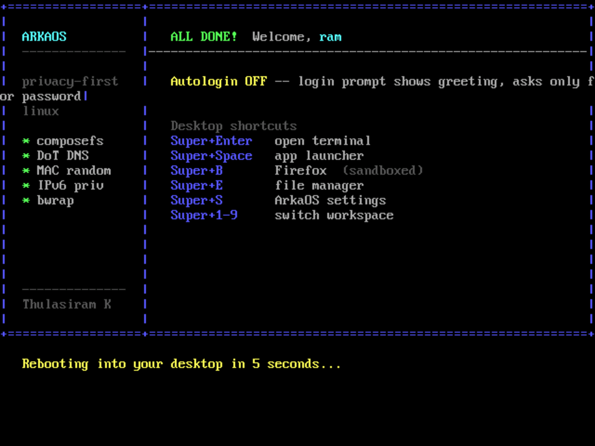

# ArkaOS

Privacy-first immutable desktop Linux. The GrapheneOS-for-desktop gap.

Built on the [bootc](https://containers.github.io/bootc/) image model — the OS is an OCI container image. Updates are atomic, the rootfs is read-only at runtime via composefs, and the entire system is reproducible from a `Containerfile`.

**Author:** [Thulasiram K](https://github.com/thulasiramk-2310) &nbsp;·&nbsp; **License:** GPL-3.0

---

## Demo



**arka-bar** — the live privacy panel. Brand · Privacy score (from `arkad` via D-Bus) · Clock. Ticks every 5 s.


---

## What it does

| Layer | What ships |
|---|---|
| Base | `fedora-bootc:42` — immutable rootfs via composefs/ostree |
| Privacy daemon | `arkad` — Rust, static musl. Enforces 4 privacy controls on boot, re-enforces every 60 s |
| Browser sandbox | Firefox wrapped in bubblewrap — home, /etc, D-Bus hidden; only ~/Downloads exposed |
| Desktop | Hyprland Wayland compositor, firstboot TUI wizard → autologin or greeter, foot terminal |
| Panel | `arka-bar` — GTK4 + gtk4-layer-shell. Brand, live Privacy score (arkad D-Bus), clock |
| Boot integrity | TPM2 PCRs 0–10 measured (firmware → GRUB → shim). PCRs 11–15 blocked — see Limitations |

**arkad enforces:**
- MAC address randomisation on every WiFi/ethernet connection (NetworkManager)
- DNS-over-TLS to Quad9 (`9.9.9.9:853`) via systemd-resolved
- Hostname locked to `arka` (hostnamectl)
- IPv6 privacy extensions (`net.ipv6.conf.all.use_tempaddr=2`)

---

## Architecture

```
┌─────────────────────────────────── ArkaOS ───────────────────────────────────┐
│                                                                               │
│  BOOT CHAIN                                                                   │
│  UEFI → GRUB → kernel 6.19 → systemd                                        │
│                      │                                                        │
│            composefs overlay (rootfs read-only, ostree object store)         │
│            No path to overwrite system files at runtime.                     │
│                                                                               │
│  TPM2:  PCR 0-10 measured ✓  (firmware, bootloader, shim chain)             │
│         PCR 11-15 dormant  ✗  (requires UKI boot path — see Limitations)    │
│                                                                               │
├───────────────────────────── Hyprland desktop ───────────────────────────────┤
│                                                                               │
│  first boot: TUI setup wizard (tty1) → useradd + autologin/greeter → reboot │
│  tty1 login → .bash_profile → exec Hyprland                                 │
│                                                                               │
│  ┌─────────────────────────────── arka-bar ──────────────────────────────┐   │
│  │  ARKA  ···················  Privacy 100  ·  19:04  2026-06-20        │   │
│  │  (GTK4 layer-shell top, polls arkad D-Bus PrivacyScore every 5 s)    │   │
│  └───────────────────────────────────────────────────────────────────────┘   │
│  Super+Return = foot terminal    Super+B = sandboxed Firefox                │
│  Super+Space  = wofi launcher    Super+E = thunar file manager              │
│                                                                               │
├──────────────────────────────── arkad ───────────────────────────────────────┤
│                                                                               │
│  Rust daemon (static musl). D-Bus service: org.arka.arkad                   │
│  Enforce on start, re-enforce every 60 s. Exposes PrivacyScore property.    │
│                                                                               │
│  ┌─────────────────┐ ┌──────────────────────┐ ┌──────────┐ ┌─────────────┐ │
│  │    mac.rs       │ │       dns.rs          │ │hostname  │ │   ipv6.rs   │ │
│  │ WiFi+eth MAC    │ │ DNS-over-TLS          │ │   .rs    │ │use_tempaddr │ │
│  │ random per conn │ │ Quad9  9.9.9.9:853   │ │  arka    │ │     =2      │ │
│  │ NM conf.d       │ │ resolved.conf.d       │ │hostnamectl│ │  sysctl    │ │
│  └─────────────────┘ └──────────────────────┘ └──────────┘ └─────────────┘ │
│                                                                               │
├──────────────────────────── firefox sandbox ─────────────────────────────────┤
│                                                                               │
│  /usr/bin/firefox ──symlink──▶ /usr/bin/firefox-sandbox  (bwrap wrapper)    │
│                                /usr/bin/firefox-unwrapped (real ELF, hidden) │
│                                                                               │
│  Inside bwrap:                     │  Not visible to browser:               │
│  /usr /lib /bin /sbin  (ro bind)   │  ~/           (tmpfs — home hidden)    │
│  /etc                  (tmpfs)     │  /etc/NetworkManager/  (WiFi creds)    │
│    + resolv.conf, hosts, ssl,      │  /etc/arkad/           (daemon cfg)    │
│      pki, fonts, nsswitch          │  /etc/machine-id       (host identity) │
│  /dev /proc            (dev/proc)  │  /run/dbus             (session bus)   │
│  /tmp /run /home /root (tmpfs)     │  ~/.mozilla/    (discarded on exit)    │
│  ~/Downloads           (bind rw)   │                                        │
│  Wayland socket        (bind rw)   │  Network: host namespace.              │
│  --unshare-pid/ipc/uts             │  arkad DoT + IPv6 active below bwrap. │
│                                                                               │
└───────────────────────────────────────────────────────────────────────────────┘
```

---

## Build pipeline

```
Arch Linux host
 └─ podman machine (Fedora CoreOS VM, rootful)
      │
      ├─ podman build  (three-stage Containerfile)
      │    Stage 1: rust:alpine
      │               cargo build --target x86_64-unknown-linux-musl
      │               → arkad  (static musl, no libc dep)
      │    Stage 2: fedora:42
      │               cargo build (glibc, GTK4 deps)
      │               → arka-bar  (GTK4 + gtk4-layer-shell)
      │    Stage 3: fedora-bootc:42
      │               arkad + arka-bar binaries + systemd units
      │               NM conf.d (MAC randomisation)
      │               resolved.conf.d (DoT)
      │               UKI artifact (in image layer — see Limitations)
      │               firefox → bwrap sandbox wrapper
      │               hyprland + foot + wofi + thunar + pipewire
      │               firstboot TUI wizard + skel config
      │               bootc container lint ✓
      │
      └─ bootc-image-builder  →  output/qcow2/disk.qcow2
```

---

## Can it run on real hardware?

**Yes.** bootc is designed for real hardware. Two paths:

**Option A — write directly to a disk:**
```bash
sudo bootc install to-disk /dev/sdX
```

**Option B — flash the qcow2:**
```bash
qemu-img convert -f qcow2 -O raw output/qcow2/disk.qcow2 arkaos.img
sudo dd if=arkaos.img of=/dev/sdX bs=4M status=progress
```

The QEMU test environment exists because it's faster to iterate than reflashing hardware. The disk image that boots in QEMU is the same image that runs on bare metal.

**Requirements:** x86_64, UEFI firmware, 20 GB disk, 4 GB RAM.

---

## Prerequisites (for building)

- Arch Linux host (or similar Linux)
- `podman` with rootful machine (`podman machine init --rootful --disk-size 40 && podman machine start`)
- `qemu-system-x86_64` + Fedora OVMF (see one-time setup below)
- `swtpm`, `swtpm_setup` (optional — TPM testing only)

---

## Build & Run

### One-time: extract Fedora OVMF

Arch's edk2 crashes Fedora 42's GRUB. Extract Fedora's own firmware once:

```bash
podman machine ssh podman-machine-default \
  "podman run --rm docker.io/fedora:42 bash -c \
  'dnf install -y edk2-ovmf -q &>/dev/null; base64 /usr/share/edk2/ovmf/OVMF_CODE_4M.qcow2'" \
  | base64 -d > OVMF_CODE_4M_f42.qcow2

podman machine ssh podman-machine-default \
  "podman run --rm docker.io/fedora:42 bash -c \
  'dnf install -y edk2-ovmf -q &>/dev/null; base64 /usr/share/edk2/ovmf/OVMF_VARS_4M.qcow2'" \
  | base64 -d > OVMF_VARS_4M_f42.qcow2
```

### Step 1 — build the container image

```bash
podman machine ssh podman-machine-default \
  "podman build --pull=newer -t localhost/arkaos:dev /var/home/Ram/arkaos/"
```

### Step 2 — produce the disk image

Kill any running test VMs first (memory pressure).

```bash
rm -rf output && mkdir output

podman machine ssh podman-machine-default "podman run --rm --privileged \
  -v /var/lib/containers/storage:/var/lib/containers/storage \
  -v /var/home/Ram/arkaos/config.toml:/config.toml:ro \
  -v /var/home/Ram/arkaos/output:/output \
  quay.io/centos-bootc/bootc-image-builder:latest \
  --type qcow2 --rootfs xfs localhost/arkaos:dev"
```

Output: `output/qcow2/disk.qcow2`

### Step 3 — boot in QEMU

```bash
cp OVMF_VARS_4M_f42.qcow2 OVMF_VARS_4M_f42_boot.qcow2

qemu-system-x86_64 \
  -enable-kvm -m 4096 -cpu host -smp 2 -machine q35 \
  -drive if=pflash,format=qcow2,readonly=on,file=OVMF_CODE_4M_f42.qcow2 \
  -drive if=pflash,format=qcow2,file=OVMF_VARS_4M_f42_boot.qcow2 \
  -drive file=output/qcow2/disk.qcow2,format=qcow2,if=virtio \
  -device virtio-vga -display gtk \
  -usb -device usb-tablet \
  -serial telnet::4445,server,nowait \
  -monitor telnet::4444,server,nowait
```

On **first boot** the setup wizard runs on tty1 — enter username, password, and whether to autologin. The system reboots into the Hyprland desktop.

---

## Sandbox isolation proof

```bash
# Write a secret to the real home directory
echo "topsecret" > ~/secret.txt

# Sandbox cannot read it — real home is hidden behind tmpfs
firefox --shell -c 'cat ~/secret.txt 2>&1'
# cat: /var/home/ram/secret.txt: No such file or directory

# WiFi credentials not reachable
firefox --shell -c 'ls /etc/NetworkManager 2>&1'
# ls: cannot access '/etc/NetworkManager': No such file or directory

# arkad config not reachable
firefox --shell -c 'ls /etc/arkad 2>&1'
# ls: cannot access '/etc/arkad': No such file or directory

# /etc is an allowlist — only essential files visible
firefox --shell -c 'ls /etc'
# alternatives  fonts  hosts  ld.so.cache  ld.so.conf.d
# nsswitch.conf  pki  resolv.conf  ssl

# Secret intact after sandbox exits (sandbox writes went to tmpfs)
cat ~/secret.txt
# topsecret
```

`firefox --shell` uses the identical `BWRAP_ARGS` array from the deployed wrapper — no gap between what this test exercises and what ships.

---

## Limitations

### PCR 11-15: measured boot is incomplete

PCRs 0-10 are measured (firmware → GRUB → shim). PCRs 11-15 (kernel + initrd + cmdline) are dormant.

`systemd-pcrphase` hits `ConditionSecurity=measured-uki` — requires the kernel to be loaded by systemd-boot via a signed UKI. GRUB loads the kernel directly; PCR 11 is never extended.

The UKI artifact exists in the image layer (`/usr/lib/modules/<kver>/<kver>.efi`, sections `.sbat .osrel .uname .linux .initrd` verified). It never reaches the ESP because `bootupd-0.2.31` ships only a `grub2-static` component — no `sdboot` component, no path for `[install] bootloader = "systemd"`.

**In practice:** no TPM-sealed disk encryption, no remote attestation against kernel/initrd state. composefs immutability is the current integrity story.

### Sandbox scope

- Network runs in the host namespace. arkad's DoT and IPv6 privacy extensions apply at the kernel/NM layer — they cover all browser traffic.
- Browser profile lives in `/home` tmpfs and is discarded on exit. No persistent state on disk. Intentional.
- Only Firefox is sandboxed. Other desktop apps run unsandboxed.

---

## Files

```
Containerfile               three-stage build: rust:alpine → fedora:42 → fedora-bootc:42
arkad/
  src/main.rs               main loop — enforce all, sleep 60 s, re-enforce on drift
  src/config.rs             serde config (secure defaults, works with no file)
  src/enforcers/            mac.rs  dns.rs  hostname.rs  ipv6.rs
  arkad.service             systemd unit (D-Bus: org.arka.arkad)
  arkad.toml                /etc/arkad/arkad.toml defaults
arka-shell/
  arka-bar/src/main.rs      GTK4 layer-shell panel — brand, Privacy score, clock
arkaos-firefox              bwrap wrapper (IS /usr/bin/firefox in the deployed image)
arkaos-hyprland-config      Hyprland config → /etc/skel/.config/hypr/hyprland.conf
sway-autostart              .bash_profile → /etc/skel/.bash_profile (launches Hyprland)
arkaos-firstboot            first-boot TUI setup wizard (username / password / autologin)
arkaos-firstboot.service    systemd unit — runs wizard once before getty@tty1
config.toml                 bootc-image-builder config (qcow2, XFS rootfs)
assets/
  demo.gif                  firstboot wizard → Hyprland desktop demo
  bar.gif                   arka-bar live — Privacy 100 · ticking clock
PHASE3-FINDINGS.md          measured-boot investigation — what's live, what's blocked
PHASE4-SANDBOX.md           sandbox model, isolation proof, scope
```
